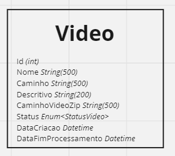
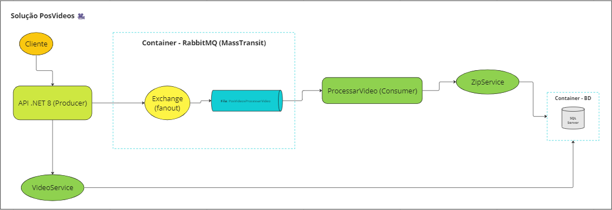
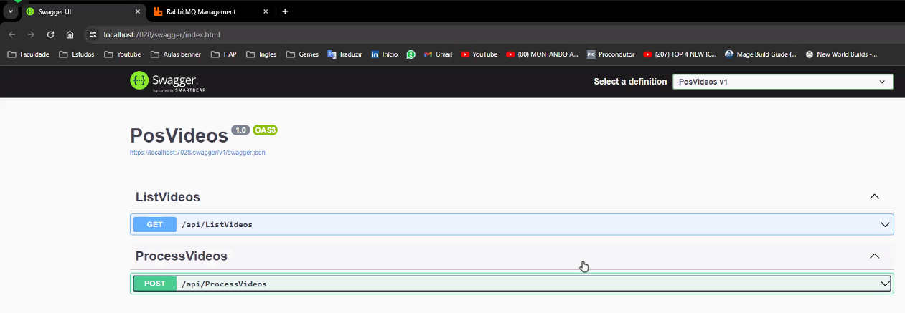

# PosVideos - FIAP Pós Tech

 #### Especialização em Arquitetura de Sistemas .NET com Azure: Hackathon

# 0. Metadados

**Nome do Projeto:** PosVideos

**Desenvolvedores do Projeto:**

| Aluno                               | RM            |  
| --------------------------------    | ------------- | 
| André Marinho Valadão Batemarchi    | 348471        | 
| André Vinícius de Angelo Falcão     | 349140        | 
| Kaique Leonardo Gomes da Silva      | 349128        |
| Nathalia Lasagna Dias de souza      | 350089        |

**Tecnologias Utilizadas:**

| Tecnologia                               | Propósito                                                      |  
| -----------------------------------      | -------------------------------------------------------------- | 
| .NET 8                                   | API, Class Library, Worker Service                             |
| Microsoft SQL Server                     | Banco de Dados                                                 |
| RabbitMQ e Masstransit                                 | Mensageria                                                     |
| xUnit, Bogus e NSubstitute               | Testes unitários/integrados                                    |
| Visual Studio e VS Code             | Desenvolvimento                                                |
| GitHub                                   | Versionamento                                                  |
| Miro                                     | Planejamento das demandas do trabalho e desenhos de diagramas  |
| Zoom                                  | Comunicação da equipe                                          |

# 1. Desafio

O hackathon consiste em solucionar um problema proposto para processamento de imagens obtidas em vídeos. A ideia principal é, a partir de vídeos submetidos pelos usuários da aplicação, obter imagens (de acordo com timestamps pré-configurados) e criar um zip delas em um diretório específico.

**Requisitos (baseados no documento fornecido):**

- Usar boas práticas de arquitetura de software;

- A aplicação deve ser .NET, com C# utilizando os conceitos
estudados no curso como: DDD, Clean Architecture Qualidade de Software e Mensageria;

- O Sistema deve processar mais de um vídeo;

- Em caso de picos o sistema não deve perder uma requisição;

- O sistema deve ter uma tela para receber os inputs;

- O sistema deve ter um local de armazenamento de dados, logo precisa de uma tela de listagem de envios (não precisa ter gerenciamento de dados);

- Não é necessário uma infra de nuvem. Pode-se criar um projeto que roda localmente.

# 2. Nossa Solução

Primeiramente, definimos que, para atender aos requisitos, faríamos um sistema distribuído, com mensageria e conteinerizado. Assim, teríamos:

1. Frontend (tela com os inputs e listagem de envios):

- React

2. API (Producer), com os endpoints:

- \<GET> Listar vídeos, com as informações dos vídeos que foram processados e comprimidos como um zip de imagens;

- \<POST> Processar vídeos, com a funcionalidade necessária para obter imagens dos vídeos submetidos, compressão das imagens e armazenamento de informações dos vídeos em BD, bem como dos zips em disco.

3. Containers:

- Docker com docker-compose.

Para implementar a mensageria, criamos os seguintes projetos:

- Uma **API** para o **Producer**;

- Um **WorkerService** para o **Consumer**;

- Um **Class Library** para centralizar os Models/DTOs;

- Um projeto de **testes** para os testes unitários e integrados da aplicação.

As tecnologias usadas para concretizar a ideia são:

- **RabbitMQ, com MassTransit** para mensageria;

- **SQL Server, com Entity Framework** para o banco de dados (BD) da aplicação;

- **Bogus** (geração de dados) e **NSubstitute** (mocks) para testes;

- **Docker Compose** para a execução da solução.

A tabela criada no BD do Consumer é baseada no seguinte modelo desenvolvido:

Status de processamento de vídeos possíveis:

- Erro;

- Processado;

- Em processamento.

## 2.1. Arquitetura Proposta

Dado o exposto até aqui, criamos a seguinte arquitetura para atender os requisitos de nossa aplicação.

De acordo com a arquitetura, temos o seguinte fluxo:

1. O cliente (usuário) consome a API (Produtor) com o intuito de obter uma lista de zips disponíveis ou submeter um vídeo para compressão.

2. A API se comunica com o servidor do RabbitMQ conteinerizado para o caso de processamento de vídeos: cria e envia mensagens para o exchange.

3. O exchange recebe as mensagens da API e as encaminha (roteia) para a fila correspondente usando o padrão fanout.

4. O Consumidor (projeto WorkerService) consome as mensagens que estão na fila e é responsável pelo processamento dos vídeos. Ressaltamos que o processamento consiste em extrair imagens de acordo com uma marcação de tempo pré-definida e comprimi-las na forma de um zip e, por fim, guardar as informações deste processamento no BD. A ideia de usar uma fila para este processamento é para que se possa fazer o upload de mais de um arquivo, sem que ocorra algum impedimento no processamento e armazenamento do arquivo, como em casos de picos.

Um diagrama representando toda a idealização da aplicação está disponível em: https://miro.com/app/board/uXjVNgeEM_w=/

## 2.2. Código Desenvolvido

Explicamos a seguir o código desenvolvido para a solução **PosVideos.sln**.

**Projeto API PosVideos (Producer):**

- Contém os Controllers, Services, classe de contexto e migrations do BD.

- Os endpoints fornecem as funcionalidades para o processamento dos vídeos e listagem de suas informações.

- A API é documentada com o Swagger.

- A classe Program contém as configurações da API, de BD e do MassTransit para fornecer os endpoints aos consumers.

- O appsettings possui as configurações de BD (connection string) e mensageria (nome da fila, servidor, usuário e senha).
  
**Projeto ProcessarVideo:**

- Contém o Worker, Services, classes de eventos (processar vídeos), classe de contexto e migrations do BD.

- A classe Program contém as configurações de serviços, de BD e do MassTransit para consumo.

- O appsettings possui as configurações de BD (connection string) e mensageria (nome da fila, servidor, usuário e senha).

**Projeto PosVideosCore:**

- Contém todos os Models/DTOs/ViewModels da entidade Video.

**Projetos PosVideosTest e ProcessarVideoTest**

- Contém os testes unitários e integrados da aplicação, com BD SQL Server.

**Pasta res:** recursos usados por este documento.

**Outras pastas:** armazenam informações de configurações das IDEs utilizadas.

## 2.3. Docker Compose Criado

Na raiz deste repositório temos o **docker-compose.yml**. Ele foi desenvolvido para criar um container para o servidor do RabbitMQ e um container para o BD da aplicação.

# 3. Aplicação em Execução

Documentação da API:

# 4. Entregáveis

Relacionamos aqui os entregáveis do hackathon:

1. Esta documentação;

2. O desenho da arquitetura apresentado na seção 2;

3. O script de criação do BD, feito via migrations, presente neste repositório: 20240316163509_IniciandoMigrationBanco.cs;

4. Link deste rep: https://github.com/nathalialasagna/PosVideos

